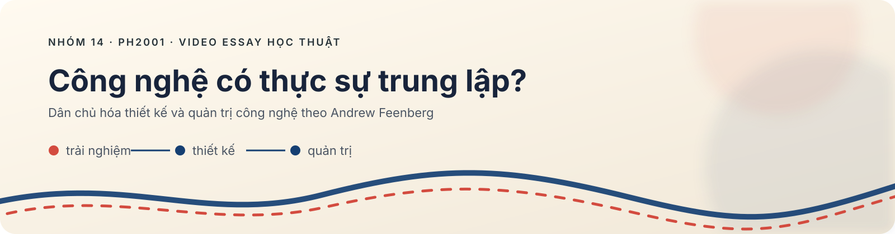
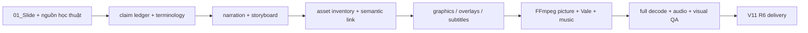

<div align="center">



# Phim tài liệu học thuật — Nhóm 14

**Dân chủ hóa thiết kế và quản trị công nghệ theo Andrew Feenberg**

[](#)
[](#)
[](scripts/)
[](scripts/)
[](#)
[](docs/PRODUCTION_HISTORY.md)

> **Câu hỏi trung tâm:** *Công nghệ có thực sự trung lập, hay những giá trị, lợi ích và quan hệ quyền lực có thể được đưa vào ngay trong quá trình thiết kế và quản trị công nghệ?*

</div>

## Tổng quan

Đây là hồ sơ nguồn và pipeline dựng video 15–20 phút cho học phần **Triết học**, lớp **PH2001.26.1.CH.02**, **Nhóm 14**. Phim dùng cấu trúc video essay: tình huống đời thường → vấn đề về tính trung lập → khái niệm của Feenberg → mã kỹ thuật và lý tính hóa dân chủ → case nguồn → chuyển dụng phương pháp luận của nhóm → kết luận.

Bản giao nộp hiện hành là **V11 R6**. GitHub giữ phần có thể đọc, kiểm tra và chỉnh sửa; file video/audio/render nặng được để ngoài Git để không vượt giới hạn 100 MiB và không làm clone chậm.

## Trạng thái delivery

| Hạng mục | Giá trị |
| --- | --- |
| File MP4 | `Nhom14_DanChuHoaThietKeVaQuanTriCongNgheTheoFeenberg.mp4` |
| Thời lượng | 1018,367 giây · 16:58,367 |
| Hình | 1920×1080 · 30 fps · H.264 High · Rec.709 |
| Âm thanh | AAC-LC stereo · 48 kHz · khoảng −15,8 LUFS · true peak −2,0 dBFS |
| Lời đọc | Một giọng Vale duy nhất |
| Phụ đề | 267 cue · Unicode tiếng Việt · tối đa 2 dòng |
| Hình động | 172 shot · 130 asset · reuse tối đa 2 |
| Kiểm tra | Học thuật, semantic-match, audio, subtitle, full-decode, YouTube: **PASS** |
| SHA-256 | `22e39eced2b8454d1ad8fdbe35d7f3d34e7e7a2cce63cc34400d99b513feb788` |

> GitHub không chứa bản MP4 vì file vượt giới hạn Git thường. Xem [danh sách media nặng](docs/HEAVY_FILES_TO_UPLOAD_DRIVE.md) và [chỉ mục media đầy đủ](docs/EXTERNAL_MEDIA_INDEX.csv) để tải từ kho nhóm vào đúng đường dẫn rồi kiểm hash.

## Nội dung học thuật được khóa

Phim giữ các phân biệt mà người xem thường đánh tráo:

- sử dụng công nghệ ≠ thiết kế công nghệ;
- tiếp cận công nghệ ≠ tham gia quyết định công nghệ;
- `technical code` / **mã kỹ thuật** ≠ mã nguồn phần mềm;
- bất định tương đối của thiết kế ≠ muốn thiết kế thế nào cũng được;
- dân chủ hóa công nghệ ≠ chỉ mở cho nhiều người dùng;
- dữ kiện nguồn ≠ diễn giải của nhóm ≠ ví dụ minh họa;
- tham gia dân chủ không đồng nghĩa bỏ chuyên môn hoặc thay mọi quyết định kỹ thuật bằng biểu quyết.

Mọi claim quan trọng phải quay về `research/claim_ledger.csv`, `research/source_inventory.md` và `research/evidence_protocol.md`. Không dùng hình AI làm bằng chứng lịch sử; các cảnh tái dựng được gắn nhãn phù hợp trong pipeline.

## Cấu trúc thư mục

Xem bản đồ đầy đủ tại [`docs/REPOSITORY_LAYOUT.md`](docs/REPOSITORY_LAYOUT.md). Tóm tắt:

```text
research/       claim ledger, thuật ngữ, nguồn và giao thức bằng chứng
scripts/        sinh storyboard, đồ họa, subtitle, render và QA
docs/           hướng dẫn cộng tác, chính sách media, lịch sử release
assets/         media Flow/Veo và graphic (không commit)
audio/          Vale, nhạc, ambience (không commit)
renders/        picture master/candidate (không commit)
qa/v11/         storyboard/validation nhẹ được chọn lọc
```

## Pipeline dựng



### Chuẩn bị trên macOS

```bash
# 1) Công cụ hệ thống
brew install ffmpeg python

# 2) Clone và môi trường Python
git clone https://github.com/thang-uit/ph2001-nhom14-feenberg-documentary.git
cd ph2001-nhom14-feenberg-documentary
python3 -m venv .venv
source .venv/bin/activate
pip install -r requirements.txt

# 3) Khôi phục media ngoài Git và xác minh SHA-256
python3 scripts/verify_external_assets.py \
  --manifest docs/EXTERNAL_MEDIA_INDEX.csv \
  --strict

# 4) Kiểm tra public repo trước khi sửa/commit
python3 -m py_compile scripts/*.py
python3 scripts/audit_public_repo.py
```

Các script V11 nhận đường dẫn rõ ràng, không tự tải Flow/Veo và không tự tiêu credit. Ví dụ render picture sau khi đủ media:

```bash
python3 scripts/render_v11_picture.py \
  --project-dir "$PWD" \
  --storyboard qa/v11/02_storyboard_v11.csv \
  --overlay-dir assets/v11_overlays_r3 \
  --segment-dir renders/v11_segments \
  --scene-dir renders/v11_scenes \
  --output renders/v11_candidate/PICTURE_MASTER_1080P.mp4 \
  --manifest renders/v11_candidate/manifest.json
```

> Lệnh trên chỉ là skeleton tái lập; không promote output mới nếu chưa chạy toàn bộ cổng trong `AGENTS.md` và xem thủ công ở tốc độ 1×.

## Media ngoài Git và Drive nhóm

Không upload tự động từ repo. Danh sách đã quét gồm đường dẫn tương đối, kích thước, nhóm ưu tiên và SHA-256:

- [`docs/HEAVY_FILES_TO_UPLOAD_DRIVE.md`](docs/HEAVY_FILES_TO_UPLOAD_DRIVE.md) — đọc nhanh, có nhóm P1/P2/P3.
- [`docs/HEAVY_FILES_TO_UPLOAD_DRIVE.csv`](docs/HEAVY_FILES_TO_UPLOAD_DRIVE.csv) — dùng cho script xác minh.
- [`docs/EXTERNAL_MEDIA_INDEX.csv`](docs/EXTERNAL_MEDIA_INDEX.csv) — toàn bộ media ngoài Git, kể cả file nhỏ hơn 50 MiB.

Ba file delivery đang có trên Drive phải được giữ nguyên. Khi chia sẻ thư mục, nên đổi quyền liên kết từ **Editor** sang **Viewer**; link Drive không được nhúng vào repo public. Xem thêm [`docs/EXTERNAL_MEDIA_POLICY.md`](docs/EXTERNAL_MEDIA_POLICY.md).

## Đóng góp an toàn

Đọc [`AGENTS.md`](AGENTS.md) và [`docs/CONTRIBUTING.md`](docs/CONTRIBUTING.md) trước khi sửa. Không commit:

- MP4/MOV/WAV/MP3, cache hoặc render;
- PDF/tệp trích xuất có bản quyền;
- email tài khoản, cookie, token, URL project cá nhân;
- manifest chứa absolute path trên máy cá nhân;
- claim chưa kiểm chứng hoặc trích dẫn tự bịa.

Repo không cấp phép lại nhạc, ảnh, footage hay tài liệu nguồn. Kiểm tra quyền sử dụng tương ứng trước khi tái phân phối ngoài nhóm.

## Giấy phép và ghi công

Nội dung học thuật, kịch bản, media và dữ liệu nguồn có quyền riêng theo tác giả/chủ sở hữu; repo này không tuyên bố một giấy phép chung cho toàn bộ tài sản. Các script có thể được nhóm cấp phép riêng ở phiên bản sau. Khi tái sử dụng, hãy giữ thông tin nguồn và provenance trong claim ledger.
