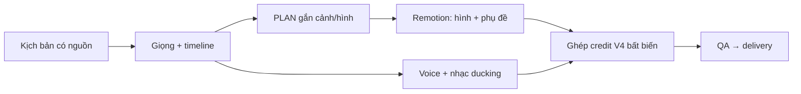

# Dân chủ hóa thiết kế và quản trị công nghệ theo Feenberg

  

**Một dự án phim tài liệu học thuật · Một repo thống nhất · Có thể tiếp tục chỉnh sửa trên máy khác.**

Kho mã nguồn của Nhóm 14, học phần Triết học PH2001. Bản hiện hành là **V13**:
kịch bản, đồ họa, footage, giọng đọc, âm nhạc, credit và hai master giao nộp đều
nằm trong repo. Không còn tầng `04_BaiTap/VideoCodex`.

> Đây là bản dựng để tiếp tục nghiên cứu và chỉnh sửa, không phải tuyên bố đã
> được giảng viên duyệt. Các nguồn còn “CẦN ĐỐI CHIẾU” vẫn được giữ trong hồ sơ.
> Việc chuẩn hóa repo không thay đổi nội dung phim hoặc file master.

[Xem sản phẩm](#sản-phẩm-hiện-hành) · [Cài đặt](#cài-đặt-trên-máy-mới) · [Sửa phim](#quy-trình-chỉnh-sửa) · [Media & bảo mật](#media-bản-quyền-và-bảo-mật)

## Sản phẩm hiện hành

| Tệp trong `delivery/` | Mục đích |
| --- | --- |
| `Nhom14_DanChuHoaThietKeVaQuanTriCongNgheTheoFeenberg_V13_1080p.mp4` | Bản Full HD để trình chiếu/nộp |
| `Nhom14_DanChuHoaThietKeVaQuanTriCongNgheTheoFeenberg_V13_2K_1440p.mp4` | Bản 2560×1440 để lưu trữ/tải YouTube |
| `KICH_BAN_TRINH_DUYET_FEENBERG_NHOM_14.docx` | Kịch bản trình duyệt, giữ nguyên định dạng được cung cấp |
| `PhuDe_V13.srt` | Phụ đề Unicode tiếng Việt theo timeline giọng đọc |

Thời lượng khoảng **19 phút 41 giây**, gồm credit gốc 54,1 giây và nối mềm 0,8 giây.
Hai master là MP4, H.264 High, 30 fps, progressive, pixel vuông, Rec.709 SDR;
âm thanh AAC-LC 48 kHz. Đồ họa bản 1440p được render ở kích thước 2560×1440;
điều này **không biến footage nguồn 1080p thành chi tiết 2K/4K thật**.

## Cấu trúc thư mục

```text
ph2001-nhom14-feenberg-documentary/
├── AGENTS.md                     quy tắc học thuật, hình ảnh, âm thanh, bảo mật
├── README.md                     tài liệu bắt đầu làm việc
├── PRODUCTION_PROGRESS_LOG.md    nhật ký công khai, không có tài khoản cá nhân
├── setup.sh / requirements.txt   cài toolchain vào repo, không nâng dependency
├── scripts/
│   ├── v13_script_content.py     nguồn sự thật của lời thoại và cảnh
│   ├── v13_script_tables.py      claim, thuật ngữ, bảng nguồn của DOCX
│   ├── common.py                 đường dẫn tương đối, font, ffmpeg
│   ├── build_v13_voice.py        TTS + cache + timeline từng từ
│   ├── build_script_docx_v13.py  xuất kịch bản từ mẫu định dạng
│   ├── v13_film.py               plan → export → picture → mix → final
│   ├── qa_v13_whisper.py         ASR tùy chọn, tải model khi chạy lần đầu
│   ├── qa_v13_asr.py             so sánh transcript ASR với kịch bản
│   ├── verify_repository.py      kiểm file, checksum, clip và cache TTS
│   └── audit_staged.py           rà dữ liệu chuẩn bị công khai trên Git
├── remotion/
│   ├── src/data/                 type + dữ liệu timeline sinh tự động
│   ├── src/film/                 footage, phụ đề, thẻ chương, chuyển cảnh
│   ├── src/gfx/                  đồ họa giải thích
│   ├── src/kit/                  màu, chữ, bố cục, chuyển động dùng chung
│   ├── tools/still.sh            ảnh tĩnh QA cho một graphic
│   └── package*.json             dependency và lockfile Remotion
├── assets/
│   ├── ai/                       31 clip AI đang dùng
│   ├── real/                     24 clip quay thật đang dùng
│   ├── photos/                   ảnh thật Andrew Feenberg
│   └── credit/                   CREDIT_TPHCM_OH_YEAH_V4.mp4 bất biến
├── audio/
│   ├── music/                    score và nhạc gốc được cung cấp
│   ├── vo/v13_vivienne/           master một giọng + timeline.json
│   └── tts_cache/                90 chunk V13, không phải cache thừa
├── templates/                    mẫu DOCX cần thiết để giữ format
├── delivery/                     1080p, 1440p, kịch bản DOCX, phụ đề SRT
├── docs/
│   ├── research/                 đối chiếu nguồn, tình huống, pháp lý, ASR
│   ├── media/                    manifest SHA-256 và ghi công
│   ├── transfer/                 thông tin gói chuyển máy
│   ├── MIGRATION_REPORT.md       phạm vi và kết quả chuyển repo
│   └── local/                    nhật ký nội bộ — KHÔNG push
└── materials/instructor/         học liệu gốc — KHÔNG push khi chưa có quyền
```

Thư mục sinh lại được và bị ignore: `.venv/`, `node_modules/`, `renders/`,
`remotion/public/`, `remotion/public_gfx/`, `remotion/build/`, `remotion/out/`.
Các skill agent cục bộ trong `.claude/` không cần để chạy pipeline.

**Lưu ý:** tiền tố `V9_` hoặc `Sxxx_` là ID nguồn của clip đang được V13 tái sử dụng,
không phải một bản phim cũ. Chỉ xóa khi đã kiểm tra không còn tham chiếu.

## Cài đặt trên máy mới

Đã chọn môi trường **macOS** vì film dùng font Avenir Next có sẵn trên máy.
Cần Python **3.10+**, Node.js **18+** (khuyến nghị 22+), npm, Git và Git LFS.
Chưa xác minh pipeline trên Windows/Linux; không tự đổi font vì sẽ đổi bố cục.

```bash
# Cài Git LFS nếu máy chưa có
brew install git-lfs

# Clone source; tải media bằng LFS
git clone https://github.com/thang-uit/ph2001-nhom14-feenberg-documentary.git
cd ph2001-nhom14-feenberg-documentary
git lfs install --local
git lfs pull

# Cài Python/npm, kiểm checksum, export dữ liệu preview
./setup.sh
```

Nếu `python3` của macOS quá cũ, chọn interpreter cụ thể:
`PYTHON_BIN=python3.13 ./setup.sh`. Chỉ cần kiểm mã mà chưa render:
`./setup.sh --skip-browser`.

`setup.sh` tạo venv cục bộ, cài các phiên bản đã khóa, tải Chrome Headless Shell
(trừ khi có `--skip-browser`), rồi tạo lại preview/SRT. **Không thu lại giọng,
không ghi lại DOCX và không render phim**. Bước export chỉ tái tạo dữ liệu từ
timeline hiện hành; với V13 nguyên vẹn, SRT không thay đổi.

Mạng có CA riêng: đặt `EXTRA_CA_BUNDLE=/duong/dan/ca.pem` trước setup.
Không dùng `NODE_TLS_REJECT_UNAUTHORIZED=0`, `strict-ssl=false` hay tắt xác minh TLS.

### Chỉ muốn xem phim

Sau `git lfs pull`, mở MP4 trong `delivery/`. Không cần chạy setup.
Đừng chỉ tải ZIP mã nguồn từ GitHub rồi cho rằng đã có toàn bộ LFS media:
hãy clone + LFS pull để nhận file thật.

## Luồng sản xuất


```mermaid
flowchart LR
    A["Kịch bản có nguồn"] --> B["Giọng + timeline"]
    B --> C["PLAN gắn cảnh/hình"]
    C --> D["Remotion: hình + phụ đề"]
    B --> E["Voice + nhạc ducking"]
    D --> F["Ghép credit V4 bất biến"]
    E --> F
    F --> G["QA → delivery"]
```

Giọng hiện hành duy nhất: `fr-FR-VivienneMultilingualNeural`, **+7%**.
Nhạc nội dung: `audio/music/SCORE_SUNO_V8_48K.wav`; credit dùng âm thanh
đã có trong credit V4, không tự thay nhạc.

## Quy trình chỉnh sửa

1. Đọc `AGENTS.md` trước; sửa nội dung tại `scripts/v13_script_content.py`,
   dữ liệu tham chiếu tại `scripts/v13_script_tables.py`. Không sửa tay DOCX/SRT.
2. Chỉ thu lại chunk thay đổi; giữ một giọng và tốc độ thống nhất.
3. Kiểm thời lượng, gán footage/graphic đúng lời thoại trong `PLAN` của `v13_film.py`.
4. Sửa đồ họa tại `remotion/src/gfx/`, không đổi font/palette tùy tiện.
5. Export, lint, xem preview rồi render; nghe/xem QA trước khi giao nộp.
6. Cập nhật manifest/checksum khi chủ động phát hành một phiên bản mới.

Từ **gốc repo**, chạy:

```bash
source .venv/bin/activate
python scripts/build_v13_voice.py --rate=+7%
python scripts/v13_film.py plan
python scripts/v13_film.py export
npm --prefix remotion run lint
```

Xem preview hình (composition Film không chứa bản mix âm thanh cuối):

```bash
cd remotion
npm run dev
# Kết thúc preview bằng Ctrl-C trước khi dùng terminal cho bước khác
```

QA một graphic trong `remotion/`:

```bash
tools/still.sh feenberg 0.25 0.6 0.95
```

Dựng lại, từ **gốc repo**:

```bash
python scripts/v13_film.py all --res 1080 --concurrency 6
python scripts/v13_film.py all --res 1440 --concurrency 6
python scripts/build_script_docx_v13.py
```

Render cần nhiều CPU, đĩa và thời gian. Giảm `--concurrency` nếu máy ít RAM.
Lệnh `all/final` thay thế MP4 cùng tên trong `delivery/`; lệnh DOCX thay thế
DOCX hiện hành. Commit hoặc sao lưu phần đã duyệt trước khi chạy.
`templates/KICH_BAN_CHI_TIET_FEENBERG_NHOM_14.docx` là mẫu định dạng cần thiết,
không phải sản phẩm lỗi thời để xóa.

## Kiểm tra & đóng góp

```bash
# Kiểm bản V13 đóng băng: checksum masters/credit + 55 clip + 90 cache TTS
python scripts/verify_repository.py

# ESLint + TypeScript
npm --prefix remotion run lint

# Rà phần chuẩn bị push
git add -A
python scripts/audit_staged.py
git diff --cached --check
git lfs fsck
git status --short
```

`verify_repository.py` khóa checksum **V13 được cung cấp**. Nếu đang dựng phiên bản
mới, không xóa kiểm tra để làm “pass”; hãy cập nhật hash sau QA và ghi rõ phiên bản.
ASR chỉ là hỗ trợ đối chiếu, không bảo đảm giọng đọc đúng 100%.
Chi tiết kiểm học thuật trong `docs/research/`; một số trang bản in còn cần đối chiếu.

## Media, bản quyền và bảo mật

- Media, âm thanh, DOCX và master dùng **Git LFS**; không giảm chất lượng để lách
  giới hạn 100 MiB của Git thường. Clone lần đầu tải vài GB dữ liệu.
- Repo public không đồng nghĩa mọi tài sản được cấp phép sử dụng không giới hạn.
  Xem [ghi công và điều kiện media](docs/media/ATTRIBUTION.md).
- Ảnh Feenberg: Beatrice Murch (Blmurch), Wikimedia Commons, **CC BY-SA 3.0**.
- Học liệu gốc ở `materials/instructor/` giữ cục bộ, chỉ chia sẻ khi có quyền;
  không cần học liệu PDF để phát lại master hoặc preview đồ họa hiện hành.
- `docs/local/` giữ nhật ký gốc có tài khoản/đường dẫn nội bộ; không commit.
  Không đưa cookie, token, khóa, `.env`, phiên trình duyệt vào repo.
- README không công khai thông tin cá nhân của người học/giảng viên.
  Credit và kịch bản do người dùng cung cấp giữ nguyên thông tin trong sản phẩm.
- Kiểm tra staged tìm các mẫu bí mật phổ biến, LFS pointer và file cấm; đây không
  phải chứng nhận bảo mật tuyệt đối.

Không nâng phiên bản Remotion/React/TypeScript. `npm audit --omit=dev` hiện
không có cảnh báo runtime; `npm audit` vẫn báo 10 cảnh báo high trong chuỗi
dev-only của `@remotion/eslint-config-flat` (Remotion đang khóa
`typescript-eslint@8.21.0`, audit không có bản vá tự động tương thích). Không tự
đổi framework chỉ để che cảnh báo; cần đánh giá nâng Remotion riêng trước khi
thay lockfile. Nội dung media bên thứ ba vẫn tuân theo giấy phép riêng; repo
chưa áp dụng một giấy phép mở chung cho toàn bộ mã nguồn và media.
